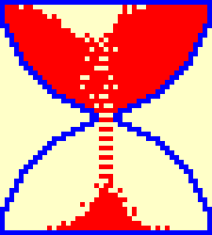
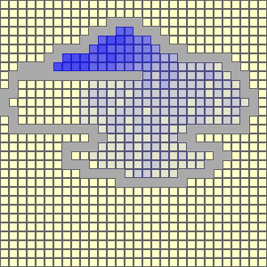

# DCC Gallery

## Movement

[Falling Rocks](../presenter.html?source=cell/movement-fall-rocks)

[Sand Clock](../presenter.html?source=cell/movement-sand-clock)

## Replication and Vanish

[Microworld](../presenter.html?source=cell/replication-vanish-microworld)

## Movement and Influence

[Cluster Colors](../presenter.html?source=cell/movement-influence-colors)

## Movement, Replication, and Vanish

[Tiny Earth](../presenter.html?source=cell/movement-replication-vanish-tinyearth)

## Water Flow

[Tiny Earth](../presenter.html?source=cell/flow-water)