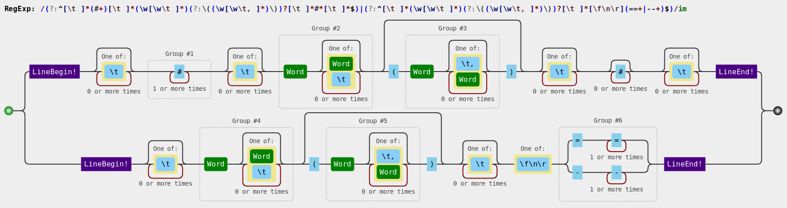
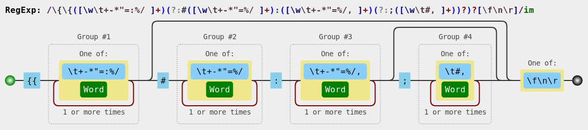
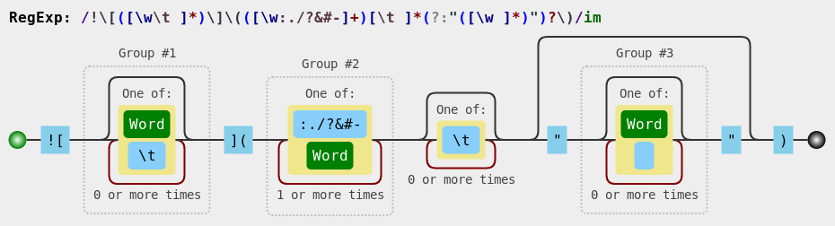
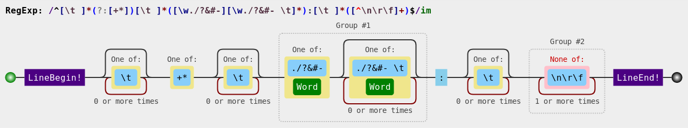
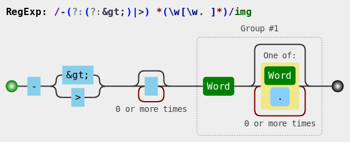
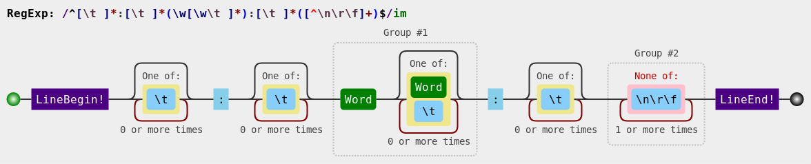
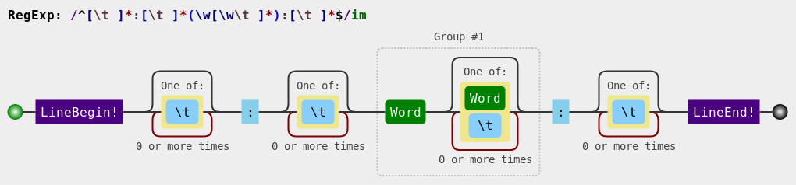
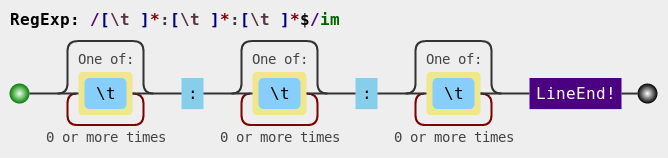
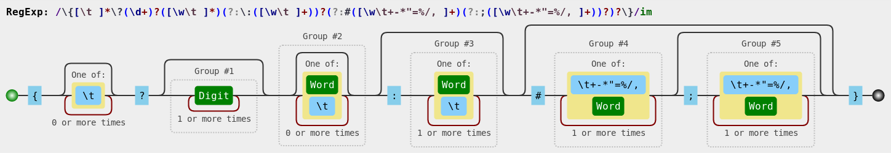
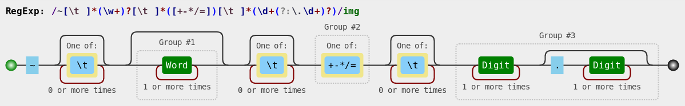

# Translator of Case Notebooks

Translates case notebook narratives (extension of markdown) to object representations and further to HTML. 

Regular expressions checked through [RegExr](https://regexr.com/).
Regular expression images generated by [Regulex](https://jex.im/regulex/).

# Case
* Object:
```
{
   name:  <case name>,
   start: <knot that starts the case>,
   knots: {<set of knots in the case>}
}
```

# Knot
### Markdown to Object
* Sentence:
```
## [title] ([category],..,[category]) ##
```
or
```
[title] ([category],..,[category])
=====
```             
* Expression: `(?:^[ \t]*(#+)[ \t]*([^\( \t\n\r\f][^\(\n\r\f]*)(?:\((\w[\w \t,]*)\))?[ \t]*#*[ \t]*$)|(?:^[ \t]*([^\( \t\n\r\f][^\(\n\r\f]*)(?:\((\w[\w \t,]*)\))?[ \t]*[\f\n\r][\n\r]?(==+|--+)$)`
  * Group #1 or Group #6: level of the knot (acordding to the number of # or the underline type === or ---)
  * Group #2 or Group #4: title
  * Group #3 or Group #5: [categories]

* Object:
```
{
   type: "knot"
   title: <title of the knot>
   categories: [<set of categories>]
   level: <level of the knot>
   content: [<elements subordinated to this knot>]
   annotations: [<set of annotations]
}
```

# Annotations

## Context
* Sentence context open: `{{ [context] #[evaluation]: [option-1], ..., [option-n]; [color-1], ... [color-n]`
* Expression context open: `/\{\{([\w \t\+\-\*"=\:%\/]+)(?:#([\w \t\+\-\*"=\%\/]+):([\w \t\+\-\*"=\%\/,]+)(?:;([\w \t#,]+))?)?[\f\n\r]`
  * Group #1: context
  * Group #2: evaluation
  * Group #3: list of options
  * Group #4: list of colors

* Sentence context close: `}}`
* Expression context close: `\}\}` 

* Object:
```
{
   type: "context"
   context: <identification of the context>
   evaluation: <characteristic being evaluated in the context - for selector>
   options: <set of options>
   annotations: [<set of annotations in this context>]
}
```

## Annotation
* Sentence outside: `{ [natural] ([formal]) #[context value] }`
* Expression outside: `\{([\w \t\+\-\*"=\:%\/]+)(?:\(([\w \t\+\-\*"=\:%\/]+)\)[ \t]*)?(?:#([\w \t\+\-\*"=\:%\/]+))?\}`
  * Group #1: natural
  * Group #2: formal
  * Group #3: context value (intended for evaluations based on selectors)

* Sentence inside: `[expression] =|: [specification] / [rate]`
* Expression inside: `([\w \t\+\-\*"]+)(?:[=\:]([\w \t%]*)(?:\/([\w \t%]*))?)?`
  * Group #1: expression
  * Group #2: specification
  * Group #3: rate

* Object:
```
{
   type: "domain"
   natural: {
      complete: <complete text in natural language>
      expression: <expression in the text to be evaluated>
      specification: <specify the expression defining, for example, a measurable value, rate or origin>
      rate: <compose the rate of the specification>
   }
   formal: {
      complete: <complete text written in formal way to be recognized against a dictionary>
      expression: <expression in the text to be evaluated>
      specification: <specify the expression defining, for example, a measurable value, rate or origin>
      rate: <compose the rate of the specification>
   }
   value: <value of the expression according to the context> 
}
```

# Items

## Text
Markdown text that does not match to any expression.
* Object:
```
{
   type: "text"
   id: 
   content: <unprocessed content in markdown>
}
```
### Object to HTML
```
<unprocessed content in markdown>
```
This content is further converted to HTML by the compiler.

## Image
### Markdown to Object
* Sentence: `!\[alt-text\]([path] "[title]")`
* Expression: `!\[([\w \t]*)\]\(([\w:.\/\?&#\-]+)[ \t]*(?:"([\w ]*)")?\)`
  * Group #1: alt text
  * Group #2: image path
  * Group #3: image title

* Object:
```
{
    type:  "image"
    alternative:   <alt text>
    path:  <image path>
    title: <image title>
}
```
### Object to HTML
```

```

## Option
### Markdown to Object
* Sentence: `+ [label] ([rule]) -> [target]` or `* [label] ([rule]) -> [target]([parameter])`
* Expression: `^[ \t]*([\+\*])[ \t]*([^\(&> \t][^\(&>\n\r\f]*)?(?:\(([\w \t-]+)\)[ \t]*)?(?:-(?:(?:&gt;)|>)[ \t]*([^\(\n\r\f]+)(?:\(([^\)\n\r\f]+)\))?)$`
  * Group #1: subtype
  * Group #2: label
  * Group #3: rule
  * Group #4: target
  * Group #5: parameter

* Object:
```
{
   type: "option"
   subtype: "+" or "*"
   label: <label to be displayed -- if there is no explicit label, the target is the label>
   rule:  <rule of the trigger -- determine its position in the knot>
   target: <resolved target -- if there is not an explicit target, the label is the target>
   parameter: <parameter for the target knot>
}
```
`<resolved target>` - target after resolving relative links.
### Object to HTML
```
<dcc-trigger id='dcc[seq]' type='[subtype]' link='[link].html' label='[display]' [image][location]></dcc-trigger>
```

## Field
### Markdown to Object
* Sentence: `+ [field]: [value]` or `* [field]: [value]`
* Expression: `^[ \t]*(?:[\+\*])[ \t]*([\w.\/\?&#\-][\w.\/\?&#\- \t]*):[ \t]*([^\n\r\f]+)$`
  * Group #1: field
  * Group #2: value

* Object:
```
{
   type: "field"
   presentation: <unprocessed content in markdown>
   field: <label of the field>
   value: <value of the field>
}
```
### Object to HTML
```
<unprocessed content in markdown>
```
This content is further converted to HTML by the compiler.

## Divert
### Markdown to Object
* Sentence: `-> [target]`
* Expression: `-(?:(?:&gt;)|>) *(\w[\w. ]*)`
  * Group #1: target

* Object:
```
{
   type: "divert",
   label: <target>
   target: <resolved target>
}
```
`<resolved target>` - target after resolving relative links.
### Object to HTML
```
<dcc-trigger link='[link].html' label='[display]'></dcc-trigger>
```

## Talk
### Markdown to Object
* Sentence: `:[character]: [talk]`
* Expression: `^[ \t]*:[ \t]*(\w[\w \t]*):[ \t]*([^\n\r\f]+)$`
  * Group #1: character
  * Group #2: speech

* Object:
```
{
   type: "talk"
   character: <identification of the character>
   speech: <character's speech>
}
```
### Object to HTML
```
<dcc-talk character='[character]' speech='[speech]'>
</dcc-talk>
```

## Talk Open
### Markdown to Object
* Sentence:
```
:[character]:
!\[alt-text\]([path] "[title]")
```
* Expression: `^[ \t]*:[ \t]*(\w[\w \t]*):[ \t]*(?:[\f\n\r][\n\r]?!\[([\w \t]*)\]\(([\w:.\/\?&#\-]+)[ \t]*(?:"([\w ]*)")?\))?[ \t]*$`
  * Group #1: character
  * Group #1: character image - alt text
  * Group #2: character image - path
  * Group #3: character image - title

* Object:
```
{
   type: "talk-open"
   character: <identification of the character>
   image: {
      alternative: <alt text>
      path:  <image path>
      title: <image title>
   }
}
```
### Object to HTML
```
<dcc-talk character='[character]'>
```
Speech is implicitly considered between `<dcc-talk>[speech]</dcc-talk>`.

## Talk Close
### Markdown to Object
* Sentence: `::`
* Expression: `/[ \t]*:[ \t]*:[ \t]*$/im`

* Object:
```
{
   type: "talk-close"
}
```
### Object to HTML
```
</dcc-talk>
```

## Input
### Markdown to Object
* Sentence: `{?[rows] [variable] : [vocabulary] # [write answer], ..., [write answer]; [wrong answer], ..., [wrong answer]}`
* Expression: `\{[ \t]*\?(\d+)?([\w \t]*)(?:\:([\w \t]+))?(?:#([\w \t\+\-\*"=\%\/,]+)(?:;([\w \t\+\-\*"=\%\/,]+))?)?\}`
  * Group #1: rows
  * Group #2: variable
  * Group #3: vocabulary
  * Group #4: set of right answers
  * Group #5: set of wrong answers

* Object:
```
{
   type: "input"
   variable: <variable that will receive the input>
   rows: <number of rows for the input>
   vocabulary: <the vocabulary to interpret the input>
   right: [<set of right answers>]
   wrong: [<set of wrong answers>]
}
```
### Object to HTML
```
<dcc-input id='dcc[seq]' variable='[variable]'[rows][vocabulary]> 
</dcc-input>
```

## Expression
### Markdown to Object
* Sentence: `~ [variable] +|-|*|/|= [number]`
* Expression: `~[ \t]*(\w+)?[ \t]*([\+-=])[ \t]*(\d+(?:\.\d+)?)`
  * Group #1: variable
  * Group #2: operator
  * Group #3: value

* Object:
```
{
   type: "expression"
   variable: <variable name>
   operator: +|-|*|/|=
   value: <value>
}
```
### Object to HTML
```
<dcc-compute expression='[expression]'></dcc-compute>
```

## Selector Context
### -- Open
### Markdown to Object
* Sentence context open: `{{ [context] #[evaluation]: [option-1], ..., [option-n]; [color-1], ... [color-n]`
* Expression context open: `\{\{([\w \t\+\-\*"=\:%\/]+)(?:#([\w \t\+\-\*"=\%\/]+):([\w \t\+\-\*"=\%\/,]+);([\w \t#,]+)?)?[\f\n\r]`
  * Group #1: context
  * Group #2: evaluation
  * Group #3: list of options
  * Group #4: list of colors

* Object:
```
{
   type: "context-open"
   context: <identification of the context> #1
   evaluation: <characteristic being evaluated in the context> #2
   options: <set of options> #3
   colors: <set of colors> #4
}
```
### Object to HTML
```
<dcc-group-selector states='[options]' colors='[colors]'>
```
### -- Close
### Markdown to Object
* Sentence context close: `}}`
* Expression context close: `\}\}` 

* Object:
```
{
   type: "context-close"
}
```
### Object to HTML
```
</dcc-group-selector>
```

## Selector
* Sentence: `{ [natural] ([formal]) #[context value])`
* Expression: <equivalent to an annotation>
  * Group #1: natural
  * Group #2: formal (extracted in an annotation)
  * Group #3: context value

* Object:
```
{
   type: "selector"
   expression: <expression to be evaluated (natural)>
   value: <right value of the expression according to the evaluated context>
}
```
### Object to HTML
```
<dcc-state-selector>[expression]</dcc-state-selector>
```

